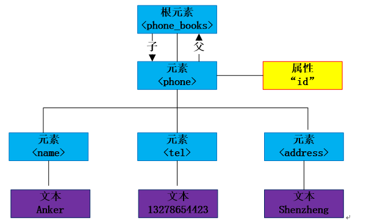

<div align="center">
<h1>xml4cj</h1>
</div>

<p align="center">


</p>

## 介绍

一个标准的 XML 文本处理的工具。    
参考地址: https://github.com/GNOME/libxml2 版本2.9.14

### 特性

- 🚀 支持Xml DOM 解析模式

- 🚀 支持Xml SAX 解析模式


## 软件架构

### 架构图

<p align="center">

</p>

### 源码目录

```shell
.
├── README.md
├── doc
│   ├── assets
│   └── feature_api.md
├── lib
├── src
│   ├── native.cj  
│   └── XmlParser.cj    
│       
└── test
    ├── HLT
    ├── LLT
    └── UT
```

- `doc` 文档目录，用于存API接口文档
- `src` 是库源码目录
- `test` 存放 HLT 测试用例、LLT 自测用例

### 接口说明

主要是核心类和成员函数说明,详情见 [API](./doc/feature_api.md)

##  使用说明

### 编译

前提：参考 https://github.com/GNOME/libxml2 官网安装 `libxml2`，版本为 `V2.9.14`。

#### libxml2 编译

1. linux 编译

   ```shell
   var=`awk '/set_target_properties.*/{print NR;exit;}' CMakeLists.txt` && sed -i ''"$var"',+10{/VERSION/d}' CMakeLists.txt
   cmake ./ -DCMAKE_BUILD_TYPE=Release
   make
   ```

2. winows 编译

   下载msys2和mingw64

   msys2：https://github.com/msys2/msys2-installer/releases/download/2023-03-18/msys2-x86_64-20230318.exe

   mingw64：https://github.com/niXman/mingw-builds-binaries/releases/download/12.2.0-rt_v10-rev2/x86_64-12.2.0-release-posix-seh-msvcrt-rt_v10-rev2.7z

   将mingw64解压到msys2的根目录

   下载cmake：https://github.com/Kitware/CMake/releases/download/v3.26.3/cmake-3.26.3-windows-x86_64.zip

   将cmake解压到D盘

   用mingw64进入libxml2目录，执行下面语句

    ```shell
    pacman -S liblzma-devel zlib-devel
    "D:\cmake-3.26.3-windows-x86_64\bin\cmake" ./ -G "MinGW Makefiles" -DCMAKE_BUILD_TYPE=Release
    make
    ```

#### xml4cj编译


1. linux 编译

   将上面生成文件 `libxml2.so`，放入根目录的 `lib` 文件夹下，之后执行

   ```
   ./build_linux.sh
   ```

2. windows 编译

   将上面生成文件 `libxml2.dll`，放入根目录的 `lib` 文件夹下，之后执行

   ```
   build_windows.bat
   ```

### 功能示例

#### Xml DOM 解析模式功能示例

```cangjie

from libxml4cj import libxml4cj.*

main() {
    let x: XmlParser = XmlParser()

    var ret = x.parse("<myxml>Some data </myxml>")
    match (ret) {
        case Some(root) => println(root.name)
        case None => println("XML Parse error.")
    }
    return 0
}
```

执行结果如下：

```shell
myxml
```

#### Xml SAX 解析模式功能示例

```cangjie

from libxml4cj import libxml4cj.*

let latestMovie = """
<collection shelf="New Arrivals">
<movie title="Movie 2021">
   <score>7.4</score>
   <year>2021-3</year>
   <description>This is a virtual film released in 2021 for testing.</description>
</movie>
<movie title="Movie 2022">
   <type>Anime, Science Fiction</type>
   <score>7</score>
   <year>2022-2</year>
   <description>This is a virtual film released in 2022 for testing.</description>
</movie>
<movie title="Movie 2023">
   <score>6.5</score>
   <year>2023-4</year>
   <description>This is a virtual film released in 2023 for testing.</description>
</movie>
</collection>
"""
class MovieHandler <: SaxHandler {
    private var curTag: String
    private var title: String
    private var score: String
    private var year: String

    init() {
        curTag = ""
        title = ""
        score = ""
        year = ""
    }

    public func startDocument(): Unit {
        println("Start Parsing.")
    }
    public func endDocument(): Unit {
        println("End Parsing.")
    }
    public func startElement(name: String, attrs: ArrayList<XmlAttr>): Unit {
        curTag = name
        if (name == "movie") {
            title = attrs[0].content
            println("Title: ${title}")
        }
    }
    public func endElement(name: String): Unit {
        if (curTag == "score") {
            println("Score: ${score}")
        } else if (curTag == "year") {
            println("Year: ${year}")
        }
    }
    public func characters(content: String): Unit {
        if (curTag == "score") {
            score = content
        } else if (curTag == "year") {
            year = content
        }
    }
}
main() {
    var handler = MovieHandler()
    let x: XmlParser = XmlParser(handler)

    x.parse(latestMovie)
    return 0
}
```

执行结果如下：

```shell
Start Parsing.
Title: Movie 2021
Score: 7.4
Year: 2021-3
Title: Movie 2022
Score: 7
Year: 2022-2
Title: Movie 2023
Score: 6.5
Year: 2024-4
End Parsing.
```

##  参与贡献

欢迎给我们提交 PR，欢迎给我们提交 issue，欢迎参与任何形式的贡献。